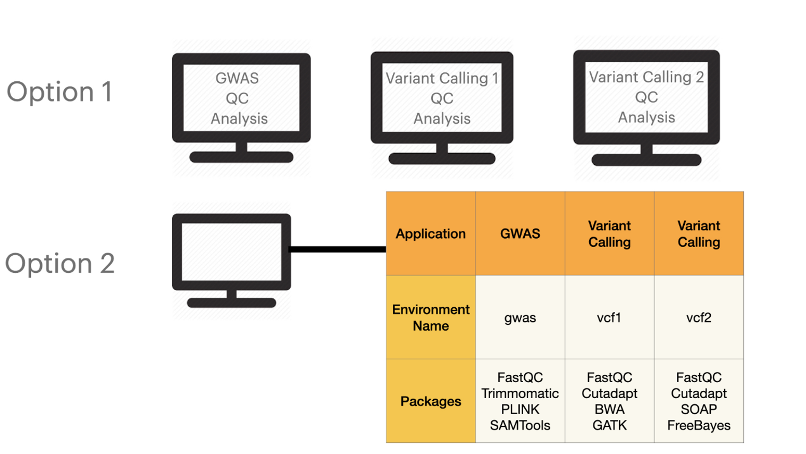

# What is conda?

Imagine you want to try 3 different analysis workflows - one for a genome-wide association study (GWAS), and 2 different variant calling workflows. Unfortunately, these workflows require similar software but different versions. One option is to run each workflow on a separate computer, but then you'd need 3 computers and that's not very practical!

Alternatively, you could set up 3 virtual environments each with their own set of software installations on 1 computer!

This alternative is possible with the help of software installation managers (i.e., `pip` for python packages) and virtual environment managers (i.e., `virtualenv` for python environments). While there are other tools that can do these separately, conda does both! Conda also:

- is operating system (OS) agnostic, meaning it works for Windows, Mac, and Linux!
- enables more simplified software installation along with dependencies
- helps you search for compatible software versions
- has access to many software packages (python, R, etc.)
- gives you admin permissions, which is good for use on high performance computers (HPC) where you'd otherwise need to request software installations or specific versions by HPC admin

### What is an Environment?

Think of software environments like school classrooms, where the school is your laptop OS. Schools have many classrooms and while they are independent rooms they are still connected by hallways. Students can walk into any room and each room will have its own set of supplies (i.e., desks, chairs, whiteboard, decorations, etc.).

For conda, the equivalent of a classroom and its supplies is a conda environment on your computer and its set of specifically downloaded software/tools. Input/output files, like students, can easily move between environments and just like a school can have multiple classrooms, conda can manage multiple conda environments. This is what makes it a great tool for maintaining different versions of the same software all on 1 computer!

### Why do we need isolated software environments?

Here are some scenarios where isolated software environments are useful:

- **versioning**: your research/project requires specific versions of software packages
- **reproducibility**: you want to experiment with new packages or features of existing packages in a separate environment to avoid compromising your current workflow
- **repeatability**: you want to replicate results from a publication or want others to be able to replicate your publication analyses
- **compatibility**: your collaborator's workflow requires a certain software/tool that is incompatible with your current system (i.e., python 2.7 instead of python 3)
