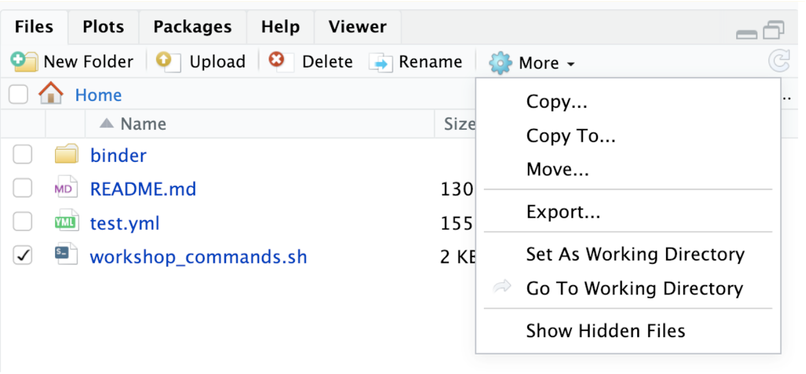

# Let's practice!

=== "Exercise 1"

    - **First**, install the `blast` software with version 2.9.0 using conda.

    - **Second**, try this example BLAST analysis in the conda environment. In this example, we are comparing the sequence similarity of a mouse protein sequence to a reference zebra fish sequence - as you might imagine, they are not that similar!
    But for today, this exercise will demonstrate running a quick analysis in a conda environment and bonus points if you find out how similar/dissimilar they are! (More details on BLAST and what each step is for [here](../Command-Line-BLAST/BLAST4.md)). Run each line of code below in the terminal:

        - Make a directory for the exercise files:
        ```
        mkdir exercise1
        cd exercise1
        ```

        - Download with `curl` command and unzip data files:
        ```
        curl -o mouse.1.protein.faa.gz -L https://osf.io/v6j9x/download
        curl -o zebrafish.1.protein.faa.gz -L https://osf.io/68mgf/download
        gunzip *.faa.gz
        ```

        - Subset the data for a test run:
        ```
        head -n 11 mouse.1.protein.faa > mm-first.faa
        ```

        - Format zebra fish sequence as the blast database to search against:
        ```
        makeblastdb -in zebrafish.1.protein.faa -dbtype prot
        ```

        - Run a protein blast search with `blastp`!
        ```
        blastp -query mm-first.faa -db zebrafish.1.protein.faa -out myoutput.txt -outfmt 6
        ```

    What does the output (`myoutput.txt`) look like?

=== "Hint"

    :bulb: You can use one of these approaches to install `blast`:

    - install the software in an existing environment using `conda install -y <name of the software>`

    - create a new environment using `conda create -y --name <name of env> <software to install>`

=== "Answer"

    There are many ways to solve this - here is one approach!

    Input:
    ```
    # search for blast versions
    conda search blast
    # create an environment and install blast version 2.9.0
    conda create -y -n exercise1 blast=2.9.0
    # activate environment
    conda activate exercise1

    # make a folder for exercise 1 files
    mkdir exercise1
    # go to the exercise1 folder
    cd exercise1

    # download input sequence files
    curl -o mouse.1.protein.faa.gz -L https://osf.io/v6j9x/download
    curl -o zebrafish.1.protein.faa.gz -L https://osf.io/68mgf/download
    # unzip the gzip files
    gunzip *.faa.gz

    # make a small example subset of the query sequence file
    head -n 11 mouse.1.protein.faa > mm-first.faa
    # format the reference database
    makeblastdb -in zebrafish.1.protein.faa -dbtype prot
    # run a protein BLAST search
    blastp -query mm-first.faa -db zebrafish.1.protein.faa -out myoutput.txt -outfmt 6
    ```

    Output looks like this:
    ```
    YP_220550.1	NP_059331.1	69.010	313	97	0	4	316	10	322	1.24e-150	426
    YP_220551.1	NP_059332.1	44.509	346	188	3	1	344	1	344	8.62e-92	279
    YP_220551.1	NP_059341.1	24.540	163	112	3	112	263	231	393	5.15e-06	49.7
    YP_220551.1	NP_059340.1	26.804	97	65	2	98	188	200	296	0.10	35.8
    ```

    The 3rd column has the percent of matching amino acids between the query mouse protein sequence file and the zebra fish reference database. Not surprisingly, mouse and zebra are not very similar! For the 1st mouse sequence in the file ("YP_220550.1"), it's only 69.01% similar to the zebra fish reference.

    Note that if you `conda deactivate`, you can still access the input/intermediate/output files from the BLAST analysis. They are not "stuck" inside the conda environment!

---

=== "Exercise 2"

    Conda allows you to revert to a previous version of your software using the `--revision` flag:

    Usage:
    ```
    # list all revisions
    conda list --revisions

    # revert to previous state
    conda install --revision <number>

    # for example:
    conda install --revision 1
    ```

    Earlier, we installed an older version of trimmomatic (0.36). Try updating it to the most recent version and then revert back to the old version.

=== "Hint"

    :bulb: You can do this exercise in any of the conda environments we created earlier with trimmomatic. You can update software with `conda update <software name>`

=== "Answer"

    There are many ways to solve this - here is one approach!

    ```
    # activate fqc environment
    conda activate fqc
    # check version of trimmomatic
    conda list
    # update to latest version, should be 0.39 or higher
    conda update trimmomatic
    # look at revision list
    conda list --revisions
    # install the revision to revert to, here we want to revert to (rev 1) which had 0.36
    conda install --revision 1
    # now it's back to 0.36!
    conda list
    ```

    Note that conda told us that it was upgrading to 0.39 and downgrading to 0.36 - useful outputs!

## Tidying up

!!! warning

    Be sure to save any work/notes you took in the binder to your computer, as any new files/changes will not be available after the binder session is closed!

    For example, select a file, click "More", click "Export":
    

To remove old conda environments:
```
conda env remove --name <conda env name>
```

To remove software:
```
conda remove <software name>
```

When you are done with using the binder, simply close the web browser tab.

!!! note "Key Points"

        There are many actions you can perform with conda environments. Today we have mentioned these!

        - init
        - config
        - search
        - create
        - activate/deactivate
        - list
        - remove
        - update
        - revert
        - export
