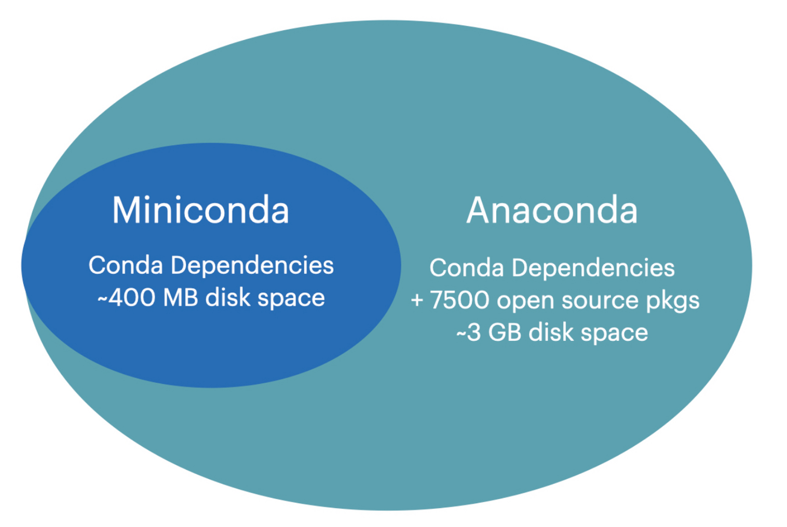

# Set up Conda on your computer

## Installation considerations

Whether you're installing conda on your own computer, a cloud instance, or high performance computer (HPC) server, you'll need to consider the following:

1. Conda installer: [Miniconda](https://docs.conda.io/en/latest/miniconda.html) vs [Anaconda](https://www.anaconda.com/products/individual)
    - Both are free versions with Miniconda being the light weight version

    

3. Operating system: Windows, MacOS, Linux
4. Bit-count: 32 vs 64-bit
    - MacOS is 64-bit only
6. Python version for root environment (2.x vs 3.x)
    - version 3.x is the default option (we recommend this!)
    - choose 2.7 version if you have mostly 2.7 code or use packages that do not have a 3.x version (but keep in mind that python 2.x [is no longer being maintained](https://www.python.org/doc/sunset-python-2/))

Conda can be installed via Miniconda (a smaller more efficient package) or Anaconda (the full installation of conda). This tutorial is a walk-through with Miniconda for MacOS. From the conda website:

> "Miniconda is a free minimal installer for conda. It is a small, bootstrap version of Anaconda that includes only conda, Python, the packages they depend on, and a small number of other useful packages, including pip, zlib and a few others. Use the conda install command to install 720+ additional conda packages from the Anaconda repository."

### Step 1: Download the installer
We are following the Miniconda [installation instructions](https://conda.io/projects/conda/en/latest/user-guide/install/index.html) specifically for [MacOS](https://conda.io/projects/conda/en/latest/user-guide/install/macos.html).

Select the [installer](https://docs.conda.io/en/latest/miniconda.html) for: "Miniconda3 MacOSX 64-bit bash". We are using the 64-bit version for working with Python 3.x.

!!! note "Linux and Windows"

    The process we are showing is very similar for installing the [Linux version](https://conda.io/projects/conda/en/latest/user-guide/install/linux.html).

    For Windows computers, you can follow [instructions](https://conda.io/projects/conda/en/latest/user-guide/install/windows.html) from conda and use the Anaconda Prompt terminal interface, which comes in the installation, to run commands.

### Step 2: Verify your installer hashes

Go to the directory where you saved the installer file (e.g., "Downloads/"). Open up Terminal and navigate to that directory:

```
cd Downloads
```


Let’s check our installation to make sure it went smoothly. We can do this by verifying the digital fingerprint or ‘hash’ of the files we just installed using the `shasum` command:

=== "Input"

    ```
    shasum -a 256 Miniconda3-latest-MacOSX-x86_64.sh
    ```

=== "Expected Output"

    ```
    ccc1bded923a790cd61cd17c83c3dcc374dc0415cfa7fb1f71e6a2438236543d  Miniconda3-latest-MacOSX-x86_64.sh
    ```

### Step 3: Install Miniconda

```
bash Miniconda3-latest-MacOSX-x86_64.sh
```

- you will be asked to review the license. Hit ++enter++ key and scroll through.

- you will be asked if you accept the license terms. Type `yes`.

- Miniconda will be installed in the location printed on the screen. Hit ++enter++ key to confirm.

- Miniconda will now be installed. This takes a few minutes to complete. The progress will be displayed in the Terminal window.

- you will be asked if you wish the installer to initialize Miniconda3 by running conda init. Type `yes`.

- for changes to take effect, `exit` and re-open Terminal window.

### Step 4: Verify that you can run conda

Now, when you re-open Terminal, the command prompt will start with `(base)`, indicating that you are in the base conda environment. It will look something like this:

```
(base) $
```

Check the version of your new conda installation:

=== "Input"

    ```
    conda --version
    ```

=== "Expected Output"

    If you got a conda version, then you are ready for the next step!

    ```
    conda 4.8.3
    ```

!!! note "Key Points"

    Now you should have a working conda installation that you can use to create custom conda environments on your computer, cloud instance, or space on an HPC server!
