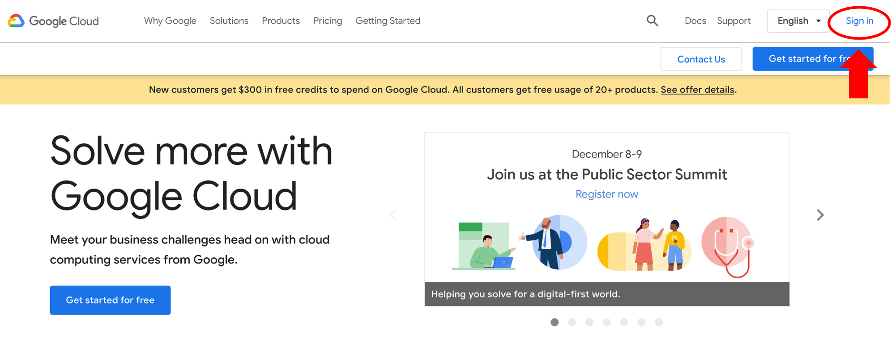
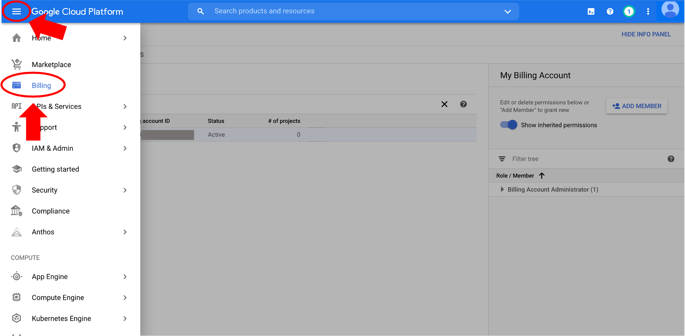
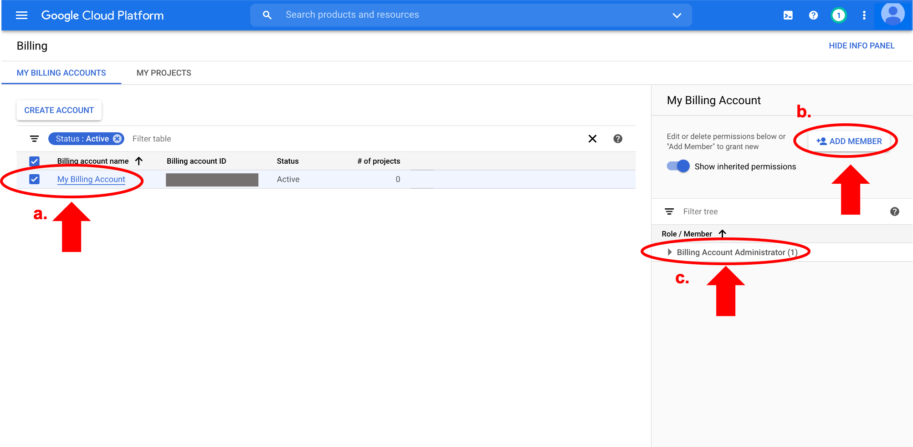
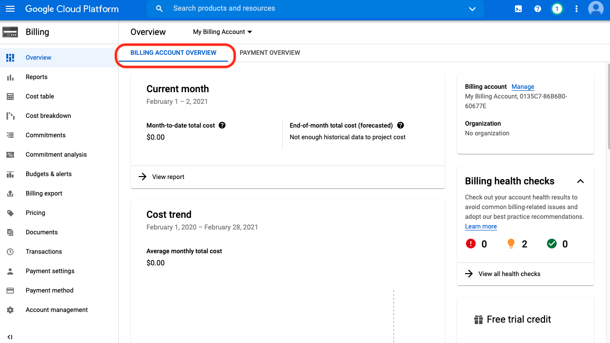
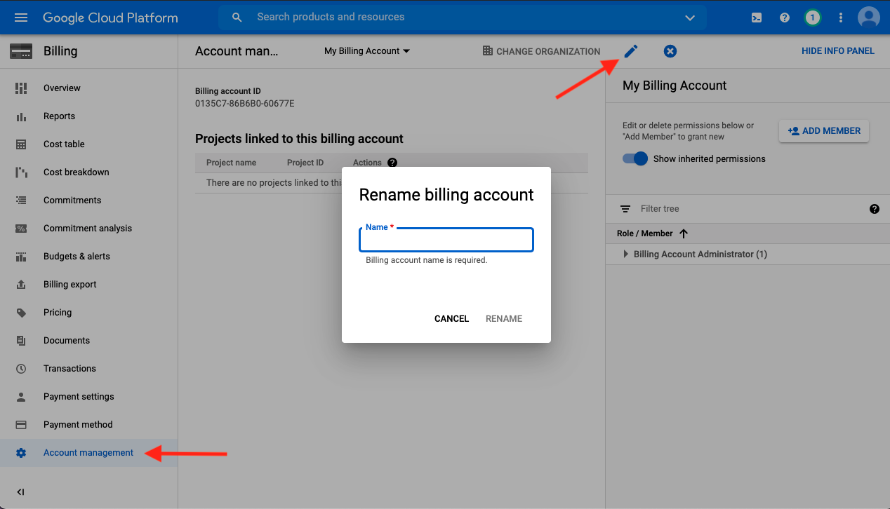

# Setting up GCP account

In this tutorial, you will learn how to create your own Google Cloud Platform (GCP) billing account using your Google account and personal credit card.

!!! important "Chrome Web-browser"

    Please use the [**Chrome web browser**](https://www.google.com/chrome/) for setting up and connecting to a GCP virtual machine. Some GCP features do not work on other web browsers.

## Step 1: Sign in to GCP

- Open a Chrome web browser and go to [https://cloud.google.com/](https://cloud.google.com/)

- Click Sign in on the top right corner and sign in with a Google account

- After successful sign in, click on Console on the top right corner.

## Step 2: Create a GCP billing account 

- Click on ACTIVATE to start setting up the billing account.

This is a 2-step process:

- On the first page, you must agree to the Terms of Service, then click Continue.

- On the second page, you'll create your payments profile. Choose either business or individual account type, enter your address and billing information, then click Start free trial. For this tutorial, we are using an individual account type.

- A message will confirm that you set up the free trial - click Got it.

!!! info "Free Credits"

    For new users, Google offers a free 3-month $300 trial account. While you still have to enter a valid credit card to set up the billing account, you will not be charged during the trial period, nor will you be automatically charged when the trial ends unless you turn on automatic billing.

## Step 3: Check billing account information

When you sign up for the GCP free trial, you should get an account confirmation email to the email address you used to sign in.

- To check the billing account, click on the three horizontal lines to open the navigation menu and scroll down to Billing.

- Select MANAGE BILLING ACCOUNTS

- Explore the **Billing** page

a) Check the box next to your billing account to show member information on right-hand panel.

b) You can add members by clicking on ADD MEMBER.

c) By default, as the owner of the billing account, you are designated the **Billing Account Administrator** role. [Read more about the different member and role options on the GCP](https://cloud.google.com/billing/docs/how-to/billing-access).

!!! note "Member Roles"

    You can add members with roles such as "Billing Account User" if, for example, you want others to have access to your GCP billing account, like team members or other platforms that use the Google cloud, such as the [Terra platform](https://app.terra.bio/).

- Optional: you can rename your billing account by clicking on the current name, which takes you to a billing overview page.

- Click Account management tab on the left panel and subsequently click on the pencil icon to bring up a popup window to enter the new name.

Now that the billing account is set up, you can use GCP resources!

!!! important

    Keep track of GCP service charges from the billing account section of the GCP console (e.g., invoice information can be found in the Transactions section). For more information and tutorials on monitoring expenses, see [GCP documentation](https://cloud.google.com/billing/docs).

    Tracking the exact and estimated costs on GCP can be challenging. See [this blog post](https://medium.com/@lukwam/reconcile-your-monthly-gcp-invoice-with-bigquery-billing-export-b36ae0c961e) for an explanation of monitoring computing costs.

    Use the [Google Cloud pricing calculator](https://cloud.google.com/products/calculator/#id=) to estimate the cost of GCP compute resources.

## Centralized billing account

Alternatively, a centralized billing account can be set up to share with a team using a G Suite organization and a Google Billing Account linked to the G Suite organization host's credit card. The Google documentation provides a [quick start guide](https://cloud.google.com/resource-manager/docs/quickstart-organizations) to set this up.

In brief, if a hypothetical user, Jon, decided to start working with the GCP, he and his administrator, Janice, would use the following workflow:

- Jon would create an Organization in G Suite and add Janice as a User to the organization.
- As the administrator, Janice has access to the credit card information, so she must set up the organization's Google billing account. Janice would log in to the GCP console using her G Suite organization Google account to set up the billing account and link a credit card in the same way mentioned [above](#create-billing).
- Janice must add Jon to the billing account as a member with the role "Billing Account Administrator" to give him the ability to edit and use the billing account.
