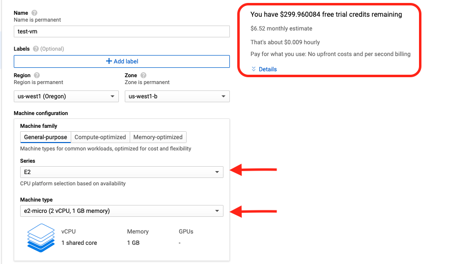
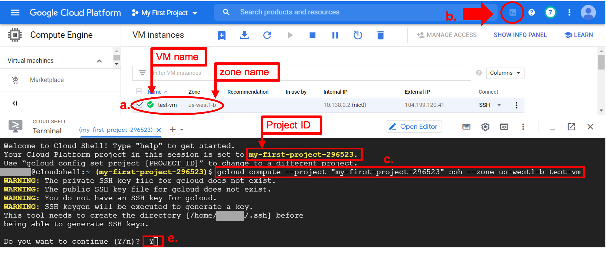

# Setting up a GCP instance

In this section, we'll create a project, configure a GCP virtual machine (VM) instance, and connect to the VM.

## Step 1: Create a project

- Click on the three vertical lines to open the navigation menu and scroll down to "IAM & Admin", select the "Manage Resources" page.


- Click on "Create Project", enter a unique project name ("My First Project" in the example below), and click "Create".


- The new project is now listed in the table, along with a project ID. You'll need the project ID later to connect to a VM instance.


## Step 2: Configure custom VM

- On the navigation menu, scroll down to "Compute Engine" and select "VM instances". It may take a few minutes to load.


- Click "Create". There are several configuration steps to set up:

### a. Name your VM


Names must be in lowercase letters or numbers. Use hyphens "-" instead of spaces. You'll need the VM name to connect to it.

### b. Choose a Region

Several regions are available from the dropdown menu. In general, select the region closest to your physical geographic region.

It is less important which zone you choose, and the interface automatically selects a zone based on the region you select. You'll need the zone name to connect to the VM. In this example, we selected the "us-west1 (Oregon)" region.

!!! note "Machine regions"

    This tool can help to choose the region closest to you (<http://www.gcping.com>). You may need to refresh several times.

### c. Choose machine type and configuration



For this tutorial, select Series "E2" and Machine type `e2-micro`. This machine type is recommended for day-to-day low cost computing. The estimated monthly cost for each machine type is shown on the top right side panel of the console page next to where you entered the VM name. Depending on the tasks you will use the VM for, you may need to choose a machine with more CPUs and memory.

!!! note "Machine types"

    See [GCP documentation](https://cloud.google.com/compute/docs/machine-types) for more information about machine type and [recommendations](https://cloud.google.com/compute/docs/machine-types#recommendations_for_machine_types) based on workload.

### d. Customize boot disk


Click on "Change". The default operating system is Debian, change it to "Ubuntu" and select version "Ubuntu 20.04 LTS". For this tutorial, we'll leave the [persistent disk storage](https://cloud.google.com/persistent-disk) as the default 10Gb. Depending on the tasks you will use the VM for, you may need to increase the storage amount.

!!! note "Persistent disk storage"

    This type of block storage allows more flexibility for computing - for example, it can be resized or accessed even after a GCP VM instance is in use or deleted. Here's a quick GCP [youtube video](https://www.youtube.com/watch?v=zovhVfou-DI&vl=en) that highlights Google's persistent disk storage features.

### e. Firewall setting


Check the box by "Allow HTTP traffic" under the Firewall configuration, which opens port 80 (HTTP) and allows you to access the virtual machine. If this box is not checked, you will get an error message when trying to connect to the VM ("Insufficient Permission: Request had insufficient authentication scopes.").

### f. Complete configuration

When you're done configuring the VM, click "Create".

## Step 3: Connect to your VM



### a. Check box by VM

### b. Open Google Cloud Shell

The GCP console provides a free Google Cloud Shell. This shell environment is useful for small tasks that do **not** require a lot of CPU or memory (as most bioinformatic analyses do). For example, it is a good place to learn how to use the Google shell environment without incurring cost or to access Google Cloud services (e.g., a Google Storage bucket or GCP virtual machine).

Click on the "Activate Cloud Shell" icon. A new panel will open on the bottom half of your screen. The first time you start the shell, you'll need to agree to the Google Cloud terms of service and privacy policy. After starting the shell, it may take a few minutes to connect. Go to the Google support [documentation](https://cloud.google.com/shell/docs/using-cloud-shell) for more information.

The Google Cloud Shell command prompt format will show: `<username@cloudshell:~ (<project id>)$`.

### c. Connect to VM

Use the `gcloud compute` command to connect to your virtual machine (`gcloud` is a tool from the Google Cloud SDK toolkit). You'll need your project ID, zone, and instance name. In the example command below, the project ID is `"my-first-project-296523"`, the zone is `us-west1-b`, and the instance name is `test-vm`. Replace these values to run the command for your virtual machine:

```
gcloud compute --project "my-first-project-296523" ssh --zone us-west1-b test-vm
```

### d. Set up SSH keys

Next, set up SSH public/private keys. This step provides an extra layer of security to protect access to your instance.

Follow the prompts in the terminal:

- "Do you want to continue (Y/n)?": type ++y++
- "Enter passphrase (empty for no passphrase)": you can create a passphrase or it can be left empty, type ++enter++ to move on
- "Enter same passphrase again": type passphrase if you created one, type ++enter++ to move on

When this process is complete, your command prompt in the terminal should switch to `<user name>@<VM name>:~$"`. You're now in the VM space!
