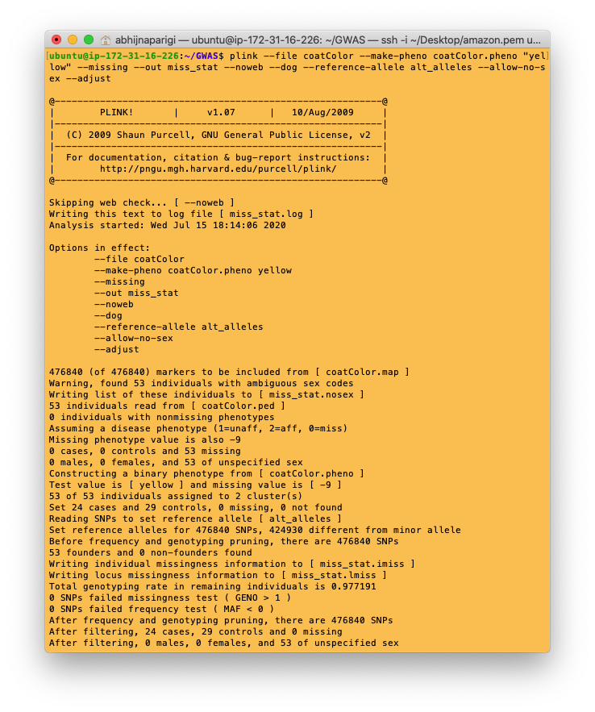
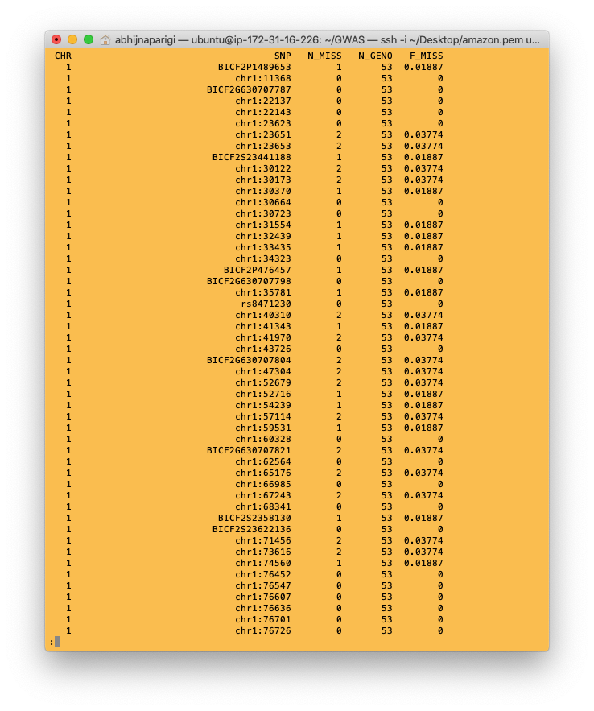
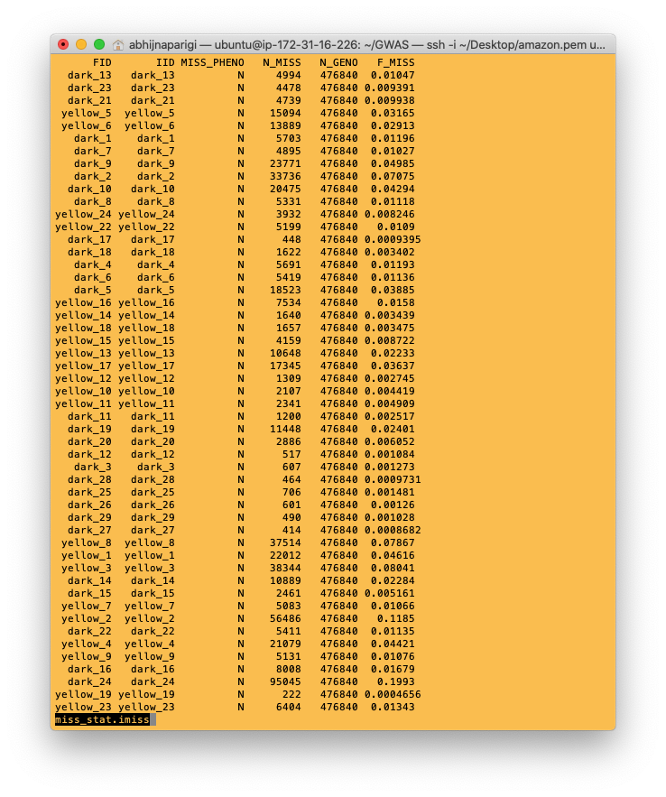

Summary Statistics and Association Analysis
===========================================

All of these steps must be performed on your Ubuntu AWS terminal window.

## Convert VCF into PLINK readable format

Remember that VCF files are variant calling files that have [this structure](https://gatkforums.broadinstitute.org/gatk/discussion/1268/what-is-a-vcf-and-how-should-i-interpret-it). PLINK does not take vcf files as inputs. So you must convert the .vcf into PLINK readable format: ped and map.

[PED and MAP files](http://zzz.bwh.harvard.edu/plink/data.shtml) are plain text files; PED files contain genotype information (one individual per row) and MAP files contain information on the name and position of the markers in the PED file.

```
 $ vcftools --vcf pruned_coatColor_maf_geno.vcf --plink --out coatColor

```

!!! Error
    If you get a vcftools install error, follow the directions in the error message to install vcftools. Visit the [vcftools](./vcftools_install.md) page of this tutorial for detailed installation instructions.

the --plink options outputs the genotype data in PLINK PED format. Two files are generated, with suffixes ".ped" and ".map"


## Create list of alternative alleles

In order to specify the minor allele as the reference allele for PLINK (A1), you must create a list of these alleles. We're calling them alternative alleles. To do so, run:

```
$ cat pruned_coatColor_maf_geno.vcf | awk 'BEGIN{FS="\t";OFS="\t";}/#/{next;}{{if($3==".")$3=$1":"$2;}print $3,$5;}'  > alt_alleles
```

where the file `alt_alleles` contains a list of SNP IDs and the allele to be set as A1.


## Quality Control

Quality control (QC) is an important step in GWAS and must be done per individual and per marker.

**Per-individual** QC of GWA data consists of identifying individuals with: 1) missing genotype or heterozygosity rate. 2) replicated samples or closely related individuals. 3) identification of individuals of divergent ancestry.

**Per-marker** QC of GWA data consists of identifying SNPs with: 1) lots of missing genotypes. 2) significant deviation from Hardy-Weinberg equilibrium (HWE). 3) largely different missing genotype rates between cases and controls. 4) very low minor allele frequencies

Read more about quality control in this journal article by [Anderson et al. 2011](https://www.ncbi.nlm.nih.gov/pmc/articles/PMC3025522/)

### Missing rates
In this tutorial, we will generate some simple summary statistics on rates of missing data in the file, using the [--missing option](http://www.cog-genomics.org/plink/1.9/basic_stats#missing):

```
$ plink --file coatColor --make-pheno coatColor.pheno "yellow" --missing --out miss_stat --noweb --dog --reference-allele alt_alleles --allow-no-sex --adjust
```

!!! Note
    **What are all these PLINK tags?**

    --file: tells it the name of PLINK readable files

    --missing: produces sample-based and variant-based missing data reports using default filters

    --out: name of the output file

    --dog: tells PLINK to look at the dog genome
    The default reference genome option is human. Other available options are: --mouse, --horse, --cow and --sheep

    --make-pheno: tells PLINK to look at the coatColor.pheno file for phenotype information and sets the alternative phenotype to "yellow"

    --reference-allele: sets the A1 or alternative allele using the file alt_alleles

    --allow-no-sex: since our dataset does NOT have a "sex" field, this option allows plink to ignore the missing sex field

    --noweb: each time PLINK runs, it checks for an update. On a slow network this sometimes causes delays and the --noweb option disables this


Output:




There's a lot of information here, but the relevant bits:

```
476840 (of 476840) markers to be included from [coatColor.map]
```
Indicates that all markers can be included.

```
53 individuals with ambiguous sex codes
```
There is no column for sex in our dataset. That's fine, you told PLINK to ignore sex.

```
Test value is [yellow] and missing value is [-9]
53 of 53 individuals assigned to 2 cluster(s)
Set 24 cases and 29 controls, 0 missing, 0 not found
```
This means there are 24 yellow coat color and 29 dark coat color individuals, and no individuals have missing phenotype data.

```
Total genotyping rate in remaining individuals is 0.977
```
About 2% of genotypes are missing after thresholding.

```
0 SNPs failed missingness test (GENO>1)
0 SNPs failed frequency test (MAF<0)
```
Here, GENO>1 means exclude an individual if all of its genotypes are missing. Obviously, this is a pretty lenient parameter. Similarly, MAF (minor allele frequency)<0 means exclude all minor alleles that have a frequency lower than 0. You may wish to change these thresholds based on your research question by explicitly specifying --mind or --geno or --maf.

The per individual and per SNP rates are then output to the files miss_stat.imiss and miss_stat.lmiss, respectively. If you had not specified an --out option, the root output filename would have defaulted to "plink".

Look at the per SNP rates by running:

```
$ less miss_stat.lmiss
```

Output:




That is, for each SNP, you see the number of missing individuals (N_MISS) and the proportion of individuals missing (F_MISS).
For examples, the SNP BICF2P1489653 is missing in 1 out of 53 individuals, giving it a missing frequency of 0.01886792452 (i.e. 1/53). Lower proportions are better!


Similarly, look at the per individual rates in the `miss_stat.imiss` by typing

```
$ less miss_stat.imiss
```

Output:



The final column is the genotyping rate for that individual. Looking at the first row, the individual dark_13 has 4994 missing SNPs out of 476840, producing a missing genotype rate of 0.01047.

In this tutorial, we are *not* excluding any SNPs or individuals from downstream association analyses. However, if the missing genotype rate per SNP or individual is high, PLINK has tags to exclude those genotypes or individuals based on [user-specified criteria](http://www.cog-genomics.org/plink/1.9/filter).

## PLINK binary format

Next, convert the output file (coatColor) to PLINK binary format (fam,bed,bim) for downstream analysis:

```
 $ plink --file coatColor --allow-no-sex --dog --make-bed --noweb --out coatColor.binary

```

--make-bed: creates a new PLINK binary fileset, after applying sample/variant filters and other operations. Click [here](http://www.cog-genomics.org/plink/1.9/data) for more details


## Run a simple association analysis

Learn more about association tests [here](https://journals.plos.org/ploscompbiol/article?id=10.1371/journal.pcbi.1002822#s7)

```
  $ plink --bfile coatColor.binary --make-pheno coatColor.pheno "yellow" --assoc --reference-allele alt_alleles --allow-no-sex --adjust --dog --noweb --out coatColor
```

!!! Note
    **What are these new PLINK tags?**

    --bfile: takes .binary file as input.

    --assoc: performs a standard case/control association analysis which is a chi-square test of allele frequency.

    --adjust: enables correction for multiple analysis and automatically calculates the genomic inflation factor
