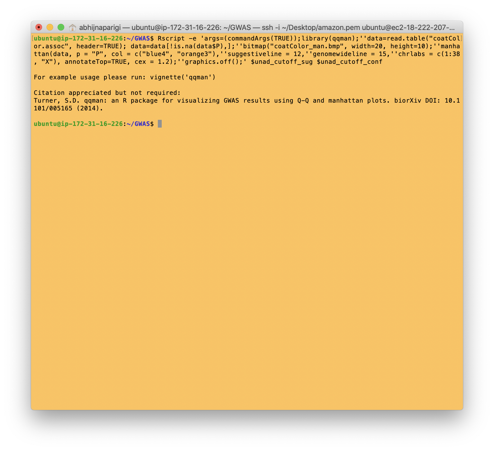
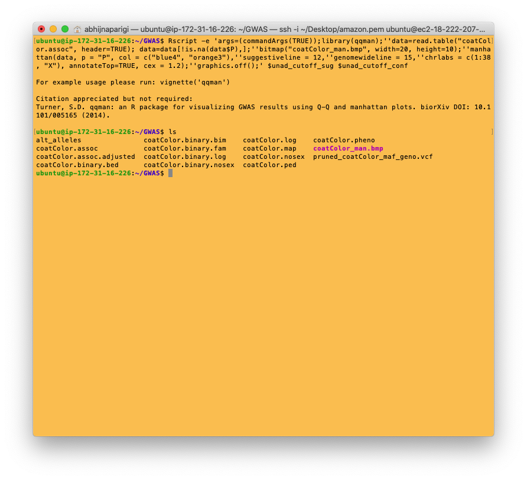

Create a Manhattan Plot
===========================================

## Install qqman package

```
sudo Rscript -e "install.packages('qqman',  contriburl=contrib.url('http://cran.r-project.org/'))"
```

## Identify statistical cutoffs

```
unad_cutoff_sug=$(tail -n+2 coatColor.assoc.adjusted | awk '$10>=0.05' | head -n1 | awk '{print $3}')

unad_cutoff_conf=$(tail -n+2 coatColor.assoc.adjusted | awk '$10>=0.01' | head -n1 | awk '{print $3}')
```

## Install GhostScript by running:

```
sudo apt-get update -y
sudo apt-get install -y ghostscript-x
```

## Run the plotting function

```
Rscript -e 'args=(commandArgs(TRUE));library(qqman);'\
'data=read.table("coatColor.assoc", header=TRUE); data=data[!is.na(data$P),];'\
'bitmap("coatColor_man.bmp", width=20, height=10);'\
'manhattan(data, p = "P", col = c("blue4", "orange3"),'\
'suggestiveline = 12,'\
'genomewideline = 15,'\
'chrlabs = c(1:38, "X"), annotateTop=TRUE, cex = 1.2);'\
'graphics.off();' $unad_cutoff_sug $unad_cutoff_conf
```

The output should look like this:



Do an `ls` to check if you've created the .bmp file.... and it worked!



## Visualization

You can visualize the Manhatten plot by downloading the coatColor_man.bmp file to our local computers. To do this, open a new terminal window like before (i.e. by selecting the terminal window and typing `cmd+N`).

Now run the following code to do the actual copying:

```
scp -i ~/Desktop/amazon.pem ubuntu@ec2-??-???-???-??.us-east-2.compute.amazonaws.com:/home/ubuntu/GWAS/coatColor_man.bmp ~/Desktop/.
```

The file has been copied to your Desktop! Here's what it should look like:


The X- axis represents haplotypes from each region of the genome that was tested, organized by chromosome. Each colored block represents the a chromosome and is made of thousands of dots that represent haplotypes. The Y axis is a p value (probability that the association was observed by chance) and is negative log transformed.

In our graph, halptypes in four parts of the genome (chromosome 2, 5, 28 and X) are found to be associated with an increase occurrence of the yellow coat color phenotype.

The top associated mutation is a nonsense SNP in MC1R (c.916C>T) known to control pigment production.

[Watch this video for a detailed explanation of GWAS Manhatten plots](https://www.google.com/search?q=how+to+read+a+manhattan+plot&oq=how+to+read+a+manhattan+plot&aqs=chrome..69i57.7911j0j4&sourceid=chrome&ie=UTF-8#kpvalbx=_tXIPX9mmFsmT0PEP64-OkAk26)
