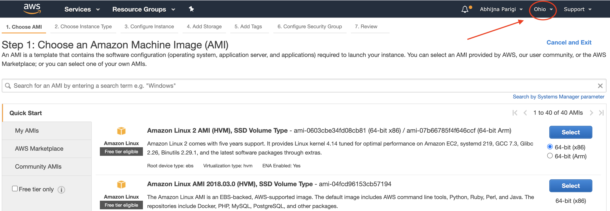
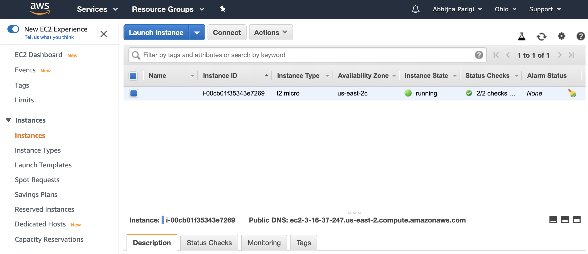

Setting up an AWS Instance
==========================

Amazon offers a cloud computing platform called Amazon Web Services (AWS). AWS is not free, however, you receive the benefits of the Free Tier automatically for 12 months after you sign up for an AWS account. If you are no longer eligible for the Free Tier, you're charged at the [standard billing rate](https://docs.aws.amazon.com/awsaccountbilling/latest/aboutv2/free-tier-eligibility.html) for your AWS usage.

Let's set up a Free Tier AWS Ubuntu instance:

## Step 1: Create AWS account

* Go to <http://aws.amazon.com/> and click on the create an AWS account button located on the top right. If you have an existing AWS account, click the "Sign in to an existing AWS account" below the "continue" option on the sign-up page and log in to your account as a root user.

!!! note "New Account"

    * To create a new account, fill in your email, (create a) password and choose a name for your AWS account. Click "Continue".

    * On the next page, fill in your name, phone number and address. Check the AWS customer agreement box.

    * Once you click "Create Account and Continue", you will be redirected to a payment info page. Fill in your credit card info. Account approval/creation requires two factor authentication and may take a few mins (to hour or days). When you receive the code, enter it and click "Verify Code"

    * You can now log in and launch an instance!

## Step 2: Configure and launch the virtual machine

* Next, click on the 'Launch a virtual machine' option as shown in the image:

### Select the right geographical region

* It is important to select the right amazon machine image from the **right geographical region**. The geographical region of your remote machine is displayed on the top right of this page (shown in image below). You want it to say "Ohio".

* If it does not say "Ohio", click on the drop down arrow and select: `US East (Ohio)`.

### Select the right Ubuntu image

* On the left navigation bar, check the Free tier only option, then select this Ubuntu machine: Ubuntu Server 20.04 LTS (HVM), SSD Volume Type (provided through 2030).

!!! Important
    Please select the Ubuntu Pro 20.04 LTS. Choosing a different machine will result in error messages during various installation steps.

* Make sure the free tier version is selected. Shown here:

Then click review and launch --> launch. You should see a pop-up window like this:

* Key pair for AWS:

    - If this is your first time using AWS or creating a key pair: Choose the 'Create a new key pair' option from the drop down menu. Under key pair name, type 'amazon' and click save. The default location for saving files on a Mac is the "Downloads" folder -- that's where your key pair can be found. **Next time you launch an instance, you can reuse the key pair you just generated.**
    - If you you have a previously generated key pair, you can reuse it to launch an instance. For this tutorial, it may be helpful to rename the key pair "amazon.pem".

* Then check the acknowledgement box and click `Launch Instance`.

* After you click `Launch Instance`, you should see this:

* Click on this first hyperlink: i-038c58bfbe9612c57. Your page should look like this:

* This page shows you a list of all your active instances. Users may launch as many instances as they wish. Just remember that every instance costs money if you don't quality for Free Tier.

You have now successfully launched your AWS instance! You will need some information from this amazon webpage to access your AWS computer, so do not close the page yet. If you happen to close the webpage on accident, click on this link: <https://us-east-2.console.aws.amazon.com/ec2/v2/home?region=us-east-2#Instances:sort=instanceId>
