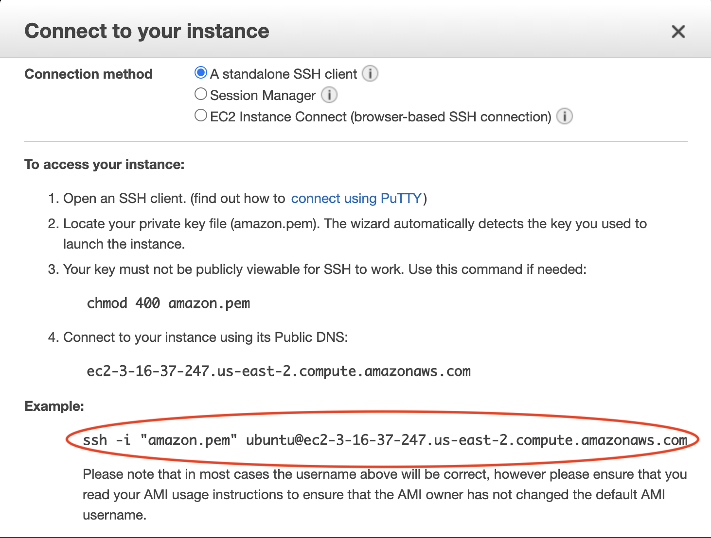

Download and move data to AWS
==============================

!!! Important
    The coat color data lives in a website called [Cyverse](https://www.cyverse.org/). It is not easy to make AWS talk to Cyverse; the fastest way to work with this dataset in AWS is to first download it onto your LOCAL computer and then upload it to AWS.

## Download data to local computer

* To download data onto your local computer you need to open up a terminal window. You can do this by searching (type cmd+space bar) for "terminal" on your Mac.

* Make a folder called GWAS on your Desktop and then navigate to the folder by typing the following commands in your terminal:

```
mkdir ~/Desktop/GWAS
cd ~/Desktop/GWAS
```

* You will use a free and open source software called [curl](https://curl.haxx.se/docs/manpage.html#-O) to retrieve data files of interest from Cyverse.

```
curl -LO https://de.cyverse.org/dl/d/E0A502CC-F806-4857-9C3A-BAEAA0CCC694/pruned_coatColor_maf_geno.vcf.gz
curl -LO https://de.cyverse.org/dl/d/3B5C1853-C092-488C-8C2F-CE6E8526E96B/coatColor.pheno
```

`-L` flag redirects the user to the right URL, if the server reports that the requested page has been moved. The `-O` flag names the local file the same as its remote counterpart.

The first command downloads the "vcf" file and the second command downloads the file that specifies phenotype information. This step may take a few seconds.

* Check if your data download worked by typing `ls`. This command lists all the files in your current (GWAS) directory. Output should be:

```
coatColor.pheno				pruned_coatColor_maf_geno.vcf.gz
```

## Locate the AWS private key file and change permissions

* Find the private key file; it is the `.pem` file you [downloaded when starting up the EC2 instance](aws_instance_setup.md). If you saved it in the default location, it should be in the "Downloads" folder. Remember, you named it "amazon.pem".

* Move "amazon.pem" to your `~Desktop/GWAS` folder with copy+paste. Remember to delete "amazon.pem" from the "Downloads" folder to avoid clutter. Check the contents of your `~Desktop/GWAS` folder again with `ls`. Do you see the "amazon.pem" file?

* Now run this command to set the permissions on the "amazon.pem" private key file to “closed to all evildoers”.

```
chmod og-rwx ~/Desktop/GWAS/amazon.pem
```
[chmod](https://en.wikipedia.org/wiki/Chmod) is an abbreviation for change mode. The `og-rwx` part removes the read, write, and execute permission for all users except the file’s owner.

## Access the AWS instance

OK, so you've created a [running computer on the cloud](aws_instance_setup.md). How do you get to it? AWS makes it easy to connect to the cloud computer via your terminal window.

The information you will need lives on the [AWS page that lists your active instances](https://us-east-2.console.aws.amazon.com/ec2/v2/home?region=us-east-2#Instances:). On this webpage, select your instance of interest and click the "Connect" button on the top of the page.


A pop up window will appear. Copy the line of code under "Example:", starting with the `ssh` command.



In your terminal, make sure you are still in the `~/Desktop/GWAS` folder (in which your "amazon.pem" lives). Paste the entire command and click enter. It should look something like this:

```
ssh -i ~/Desktop/GWAS/amazon.pem ubuntu@ec2-???-???-???-???.compute-1.amazonaws.com
```

!!! Important
    Replace the stuff after the ‘@’ sign with the name of your host computer.


!!! Tip
    You will see this message when running the ssh command for the first time:

    The authenticity of host 'ecc2-???-???-???-???.compute-1.amazonaws.com (3.129.57.169)' can't be established.
    ECDSA key fingerprint is XXX.
    Are you sure you want to continue connecting (yes/no/[fingerprint])? **yes**

    Type "yes" and press enter.


* If everything works ok, you should see something like this:


!!! Note
    My terminal window is yellow, but yours may not be!

* You have now successfully logged in as user ‘ubuntu’ to the machine ‘ec2-18-216-20-166.us-east-2.compute.amazonaws.com’ using the authentication key located in ‘amazon.pem’ on the Desktop.

* This is your remote/cloud Ubuntu computer. Look at what's in this computer by typing `ls`. If nothing happens, it means there are no folder or files to list!

* Make a folder called "GWAS" in the Ubuntu computer by typing:

```
mkdir GWAS
```
Check if you have this directory with `ls`.


## Upload data to AWS

* To upload data from your local computer to AWS, you must first logout of AWS. Type:

```
logout
```

* Now you are back in your local Mac terminal. You can upload files to AWS by typing this command:

```
scp -i ~/Desktop/GWAS/amazon.pem ~/Desktop/GWAS/pruned_coatColor_maf_geno.vcf.gz ubuntu@ec2-???-???-???-???.compute-1.amazonaws.com:~/GWAS/
scp -i ~/Desktop/GWAS/amazon.pem ~/Desktop/GWAS/coatColor.pheno ubuntu@ec2-???-???-???-???.compute-1.amazonaws.com:~/GWAS/
```
Here `scp` is short for secure copy. [`scp` allows files to be copied to, from, or between different hosts](http://www.hypexr.org/linux_scp_help.php). It takes three arguments:

1) The first `~/Desktop/GWAS/amazon.pem` is the path to your private key file ("amazon.pem" in this case) which serves as a password for AWS. You will also need the `-i` flag; it tells `scp` to look for a private key file.

2) The second argument `~/Desktop/GWAS/pruned_coatColor_maf_geno.vcf.gz` is the path to the file on your local machine (that needs to be copied).

3) The last argument `ubuntu@ec2-???-???-???-???.compute-1.amazonaws.com:~/GWAS/` is the path to the AWS folder where the file will be pasted.

So you're copying files from the GWAS folder on your local machine to the GWAS folder in the remote Ubuntu computer. Be sure to **change the ec2 instance name** like you did earlier.

* To check if this worked, log back into the remote Ubuntu instance by **typing in the ssh command described above**. Then change directory to the GWAS and list files in it:

```
cd GWAS
ls
```
Do you see the files?

* Finally, unzip the `pruned_coatColor_maf_geno.vcf.gz` file using gunzip.

```
gunzip pruned_coatColor_maf_geno.vcf.gz
```
This command should remove the `.gz` from the file name.
