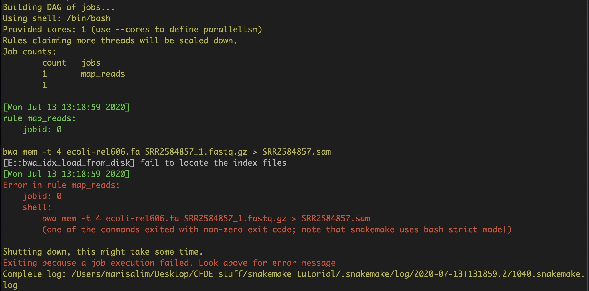

# The Snakefile

Snakemake uses a file called 'Snakefile' to configure the steps, or rules, of your pipeline. The basic Snakefile consists of several rules defining the inputs, outputs, and rule commands.

!!! tip
    The [first vidlet](https://video.ucdavis.edu/media/snakemake+intro%2C+try+2/0_843yn8pn/166161802) starts here.

### Editing the Snakefile

Let's take a look at the Snakefile using the nano text editor:
```
(snaketest) $ nano -ET4 Snakefile
```

This is the skeleton of our Snakefile for calling variants. The command above tells nano to open the Snakefile and to create 4 spaces when you hit the `tab` key. The Snakefile is written in the Python programming language, which uses specific indentation formatting to interpret the code. Incorrect indentation will result in syntax errors.

There are several rules defined with commands to run, but we'll need to add a few more details by editing with nano.

!!! note "Practice"
    Add a comment to the Snakefile:

    1. open Snakefile in nano

    2. on a new line, add a comment with `#`, e.g., `# This is my first edit!`

    3. save the change by hitting `control` key and `o` key. nano will ask if you want to save the file as 'Snakefile'. We want to keep the same file name, so hit `return` key.

    4. exit nano by hitting `control` key and `x` key.

    5. view the Snakefile in Terminal with: `less Snakefile`.

    6. if you can see your comment, it worked! Exit the `less` view by hitting `q` key.

!!! Tip

    Please refer to the [bash command cheatsheet](./bash_cheatsheet.md) for commonly used nano commands other shortcuts for navigating your Terminal!

Ok, let's move on and take a look at the structure of the Snakefile rules.

### Snakefile rules
Each step in a pipeline is defined by a rule in the Snakefile. Note that the components of each rule are indented 4 spaces. The most basic structure of a rule is:
```
rule <rule name>:
    shell:
        # for single line commands
        # command must be enclosed in quotes
        "<command>"
```

There are several rules in the Snakefile. Let's do a search for all the rules in the file:
```
(snaketest) $ grep rule Snakefile
```
The output is a list of the lines in the Snakefile with the word 'rule' in them. There are 11 rules in this pipeline.
```
rule download_data:
rule download_genome:
rule uncompress_genome:
rule index_genome_bwa:
rule map_reads:
rule index_genome_samtools:
rule samtools_import:
rule samtools_sort:
rule samtools_index_sorted:
rule samtools_mpileup:
rule make_vcf:
```

## snakemake & Snakefile
Let's try running a rule with the `snakemake` command:
```
(snaketest) $ snakemake -p map_reads
```

The `-p` means 'show the command that you're running'.

Oops, this will fail! Why?


As the error message in red says, the rule failed because we don't have any of the input files to run this rule yet! We don't have the genome or the fastq.gz, and we need to prepare the genome by indexing it.

We need to download some files and prepare them first. Let's start with the first rule instead in the Snakefile:
```
(snaketest) $ snakemake -p download_data
```

What does this command do? It tells snakemake to run the shell command listed under the `download_data` rule. In this case, that command downloads some data from a public repository on osf.io. This is one of the files we need for mapping!

It worked!


Check the working directory. There should now be a .fastq.gz file:
```
(snaketest) $ ls -lht
```

This command shows you the file permissions, number of links, owner name, owner group, file size in bytes, time of last modification, and file/directory name.

Now run some more rules – one at a time:
```
(snaketest) $ snakemake -p download_data
(snaketest) $ snakemake -p download_genome
(snaketest) $ snakemake -p uncompress_genome
(snaketest) $ snakemake -p index_genome_bwa
(snaketest) $ snakemake -p map_reads
```

Check the working directory again. This time, there are a bunch of output files and we were able to run the `map_reads` rule without getting error messages!

!!! recap

    In the current Snakefile, we’ve stored our commands and told snakemake to run them individually. In the next section, we'll cover how to connect the rules so snakemake can recognize rules that depend on each other and run them in the correct order.

    - these are just shell commands, with a bit of “decoration”. You could run them yourself directly in the terminal if you wanted!
    - the order of the rules in the Snakefile doesn’t matter, but as written, the order that you run them in does!
    - by default, if you don't specify a rule, snakemake runs the first rule in the Snakefile (this is actually the only case where the order of rules in the Snakefile matters!)
    - output snakemake message is in red if it fails
    - the code is case-sensitive
    - tabs and spacing matters

!!! Tip

    Please refer to the [snakemake command cheatsheet](./snakemake_cheatsheet.md) for commonly used snakemake commands!
