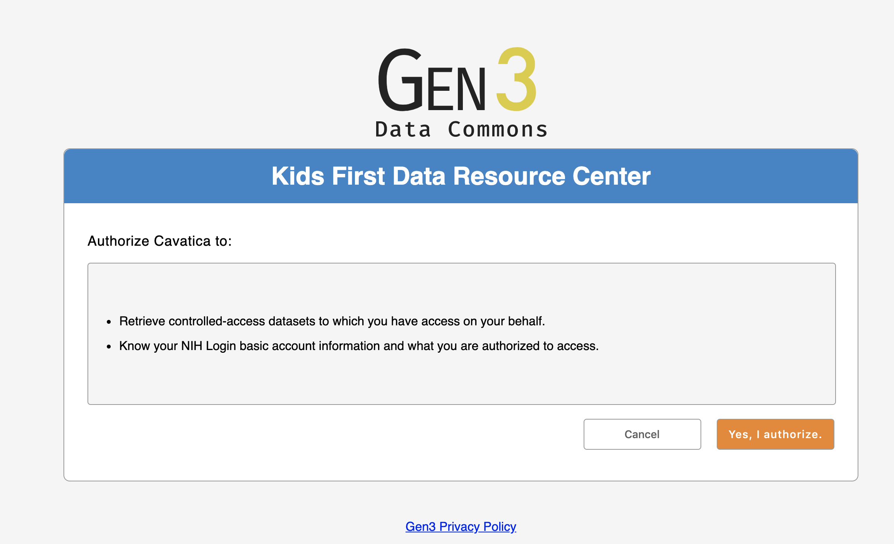
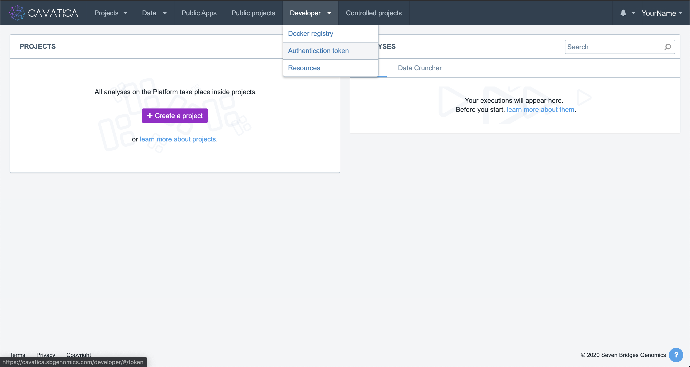
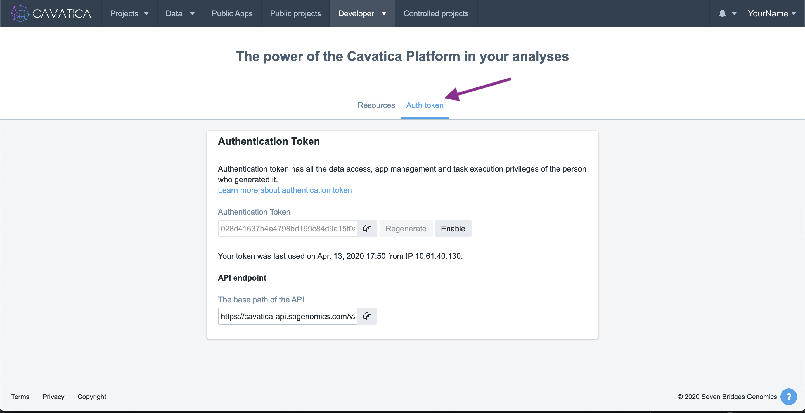
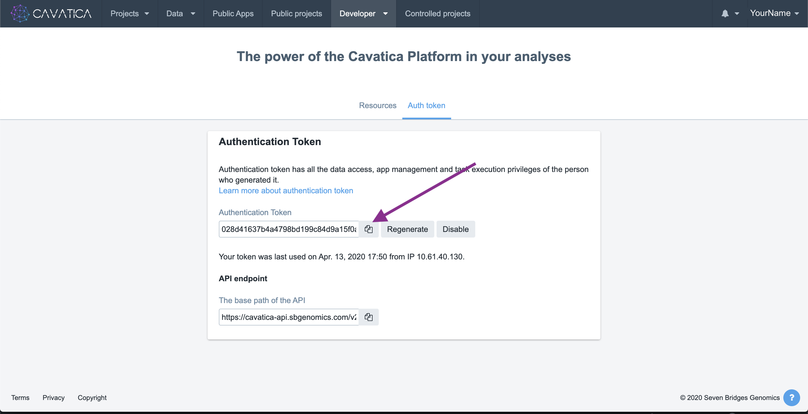
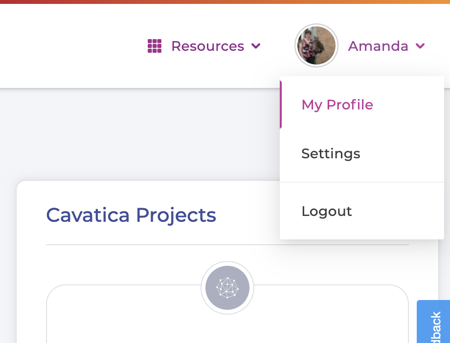
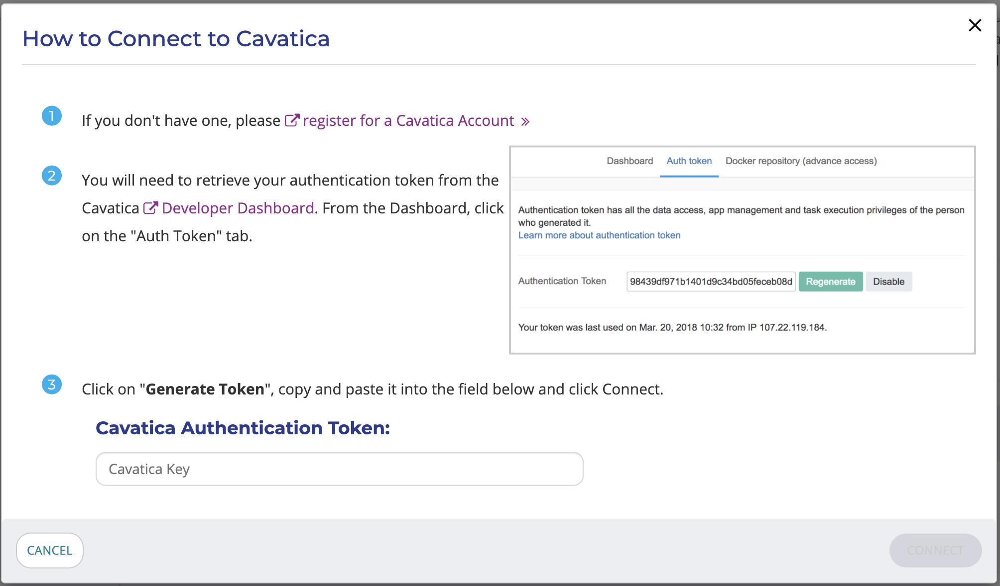

Connecting Accounts
===================

We want to use Cavatica to analyze data we find using the
portal, which means our two accounts need some kind of connection.
However, when we made our account for Cavatica, we went to a separate
website, and logged in using a completely different identity than we did
at the Kids First DRC Portal. At Cavatica, we used our eRA Commons ID
(or an email), but at the Portal we used an ORCID. So, we will have to
tell our two accounts about each other.

Since the data we want to use is from Kids First,
it is subject to human data protections. Right now, we haven't told the
portal or Cavatica about our credentials, or what we're authorized to
see. Remember that there are rules about human data *even if it's open
data* so we will need to tell these systems a bit about ourselves before
they trust us.

Creating a Kids First Portal to Cavatica Connection
---------------------------------------------------

#### Step 1 Get logged in to Cavatica

Navigate to <https://cavatica.sbgenomics.com/> and use the credentials
you set up in the previous page of this lesson to log in, if you used a
eRA Commons ID, this will be a multi-step process. As part of your
log-in process, you *must* authorize Gen3:

!!! note
    If after clicking on 'Log in with eRA Commons', you see a page
    that asks for a 'Smart Card Login', logging in with your eRA Commons
    user name and password should take you to the Gen3 page.

#### Step 2 Go to the Cavatica Developer Dashboard

To connect the Kids First Portal to our Cavatica
account we need to create a personalized code in Cavatica, and give it to
the portal. Cavatica calls this code an "Auth token" or "Authentication Token".This process can be daunting for new users, but is a pretty common way
of connecting accounts across different systems. In fact, we'll have to
do it again in this lesson!

<!-- and keeps the tool that creates them a Developer tool.
-->

Click on the Developer tab at the top of the screen, and select
Authentication Token:

#### Step 3 Click on the Auth token link

There is all sorts of developer tool information on this page, but
we're going to ignore most of it for now, and click on `Auth
token` (indicated by the purple arrow below) in the middle
of the page, to get this screen:

#### Step 4 Generate and copy your Authentication Token

Click on the `Generate` button to create your first token or the `Regenerate` button to create a new
Authentication Token, and then click the copy button (indicated with a
purple arrow below) to copy it to your clipboard:

!!! Tip

    Keep this tab

    We still have some clicking around to do before we use this token, so
    it's best to leave this tab open until we're done, so you can re-copy
    it if you need to

#### Step 5 Get logged in to the Kids First DRC Portal

In a new tab or window, navigate to the Kids First DRC Portal
<https://portal.kidsfirstdrc.org/> and use the credentials you set up in
the previous page of this lesson to log in.

Once you're logged in, at the top of your window you should see this
bar:

!!! Error

    Error with existing ORCIDs

    If you don't see this navigation bar, your browser may not have
    properly refreshed with your log in information. Try pressing
    `F5` (Windows) or `Cmd+Shift+R` (MacOS) to
    refresh, or click the refresh button next to the address bar in your
    browser.

#### Step 6 Navigate to Settings

Click on your name (top right) and Select Settings:

#### Step 7 Navigate to Application Integration

The Portal calls a connection to Cavatica an "Application
Integration". It is generic, because in theory, you could connect Kids
First to any analysis platform that uses the same authorization
infrastructure, however currently Cavatica is the only available
application integration.

Scroll down to Application Integration and click on the "Connect"
button. You should get a pop up that looks like this:

#### Step 8 Input your Authentication Token

We've already created Cavatica accounts, and generated our token, so
we'll skip to step 3, paste in our token, and click `Connect`

!!! Tip

    Token Security

    An Authentication Token is kind of like a password, you don't want to
    share it, or post it anywhere public. Anyone who pastes your
    Authentication Token into their Kids First account will have access to
    your Cavatica space. If you want to give collaborators access to your
    Cavatica space, [there is a much easier (and safer) way to do that
    within Cavatica.](http://docs.cavatica.org/docs/add-a-collaborator-to-a-project)
    (Tutorial coming soon)
