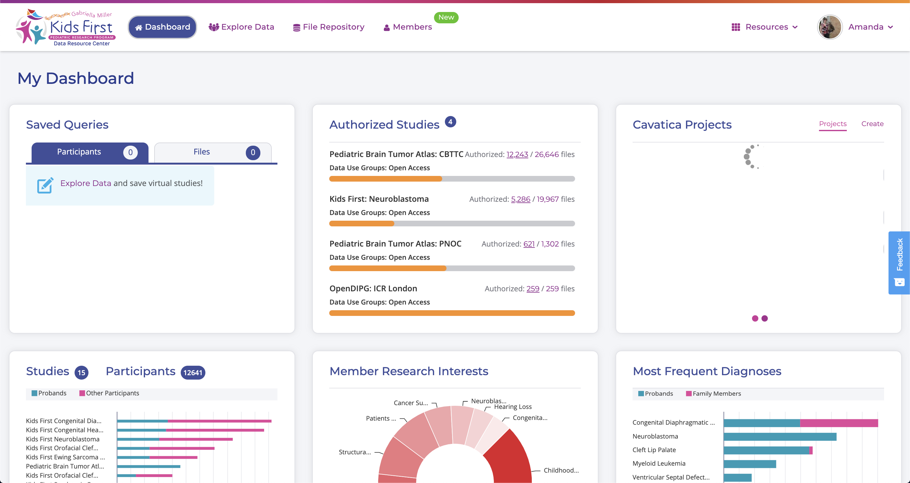

Exploring Data in the Portal
============================

Now that all of our accounts are interconnected, let's actually explore
the data.

What data is here?
------------------

The data at the Kids First DRC is from children with childhood cancer
and structural birth defects or their family members. As of early 2020,
the Kids First DRC maintains Whole Genome Sequences (WGS) and/or RNAseq
data for over 12,000 individuals. However, Kids First doesn't only host
data about DNA and RNA. Using the portal you can access a wide range of
data types including Histology Images, Pathology Reports, Radiology
Images, Radiology Reports, Operation Reports, Annotated Somatic
Mutations, Gene Fusions, Gene Expression, Somatic Copy Number
Variations, and Isoform Expression.

### Step 1 Get logged in to the Kids First DRC Portal

If you aren't still logged in to the Kids First Portal, navigate to
<https://portal.kidsfirstdrc.org/> and use the credentials you set up
previously in this lesson to log in. When you first log in, you will see
this screen:

### Step 2 Navigate to the Explore Data tab

Click on `Explore Data`

You should now be on a page that looks like this:

Exploring the Data
------------------

It is important to get a sense of what data exists before we start
filtering down and designing an experiment. This page gives us a set of
six interactive plots that display the overall data. You can impose
filters on the data in two different ways:

-   By using the filter buttons
-   By clicking a graph component of any plot
